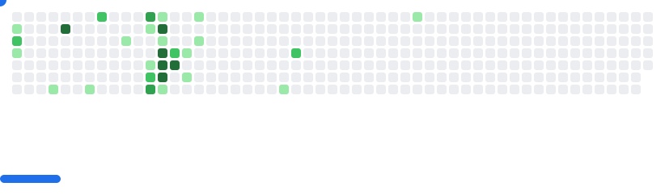

## Hey I'm Linh 👋

```json
{
  "job": "AI Engineer",
  "birthday": "2004-01-23",
  "country": "Viet Nam",
  "city": "Ho Chi Minh",
  "stack": ["Python", "C/C++", "Docker", "..."],
  "interest": ["Tech", "Sports", "Gaming", "..."]
}
```
---
<picture>
  <source
    media="(prefers-color-scheme: dark)"
    srcset="images/breakout-dark.svg"
  />
  <source
    media="(prefers-color-scheme: light)"
    srcset="images/breakout-light.svg"
  />
  
</picture>
